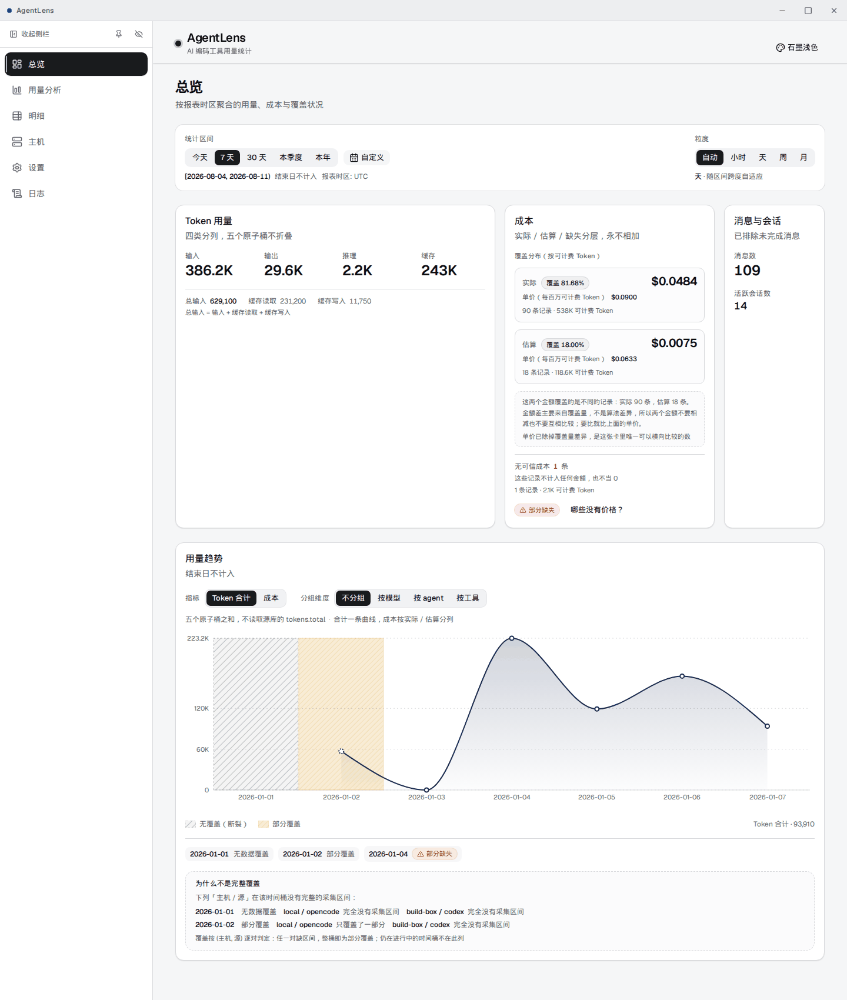
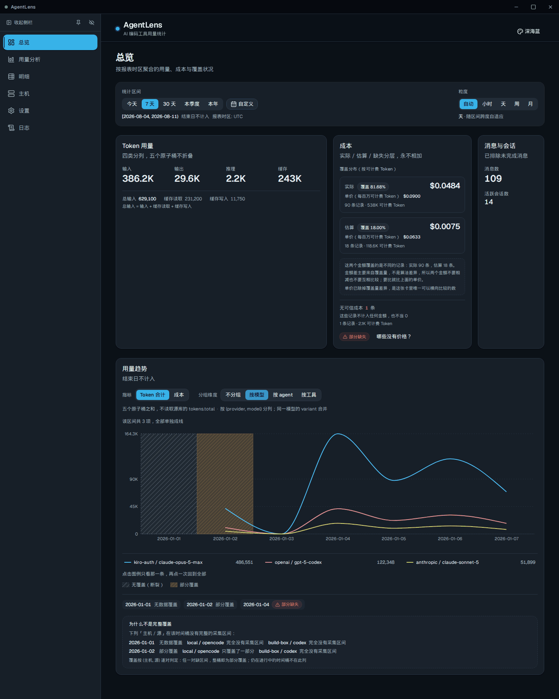
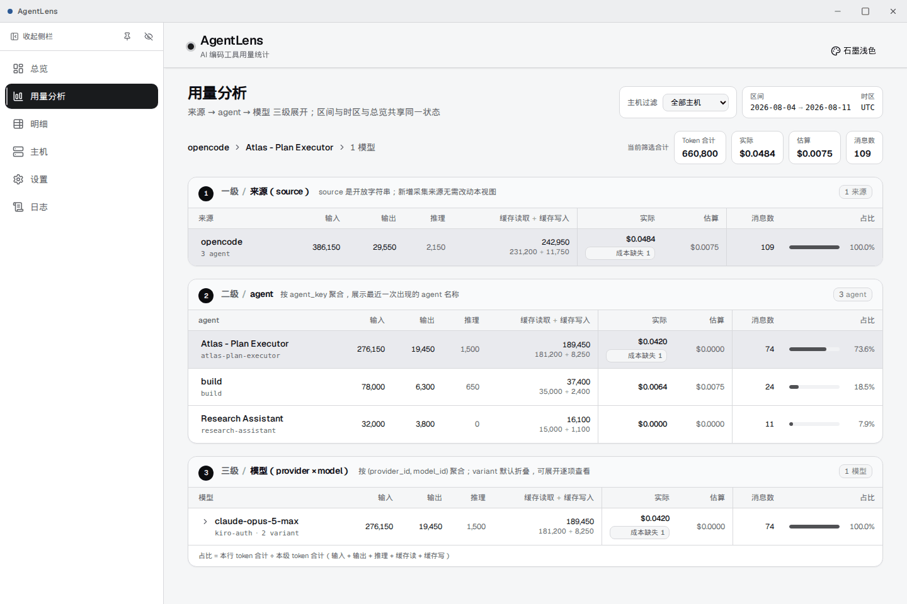
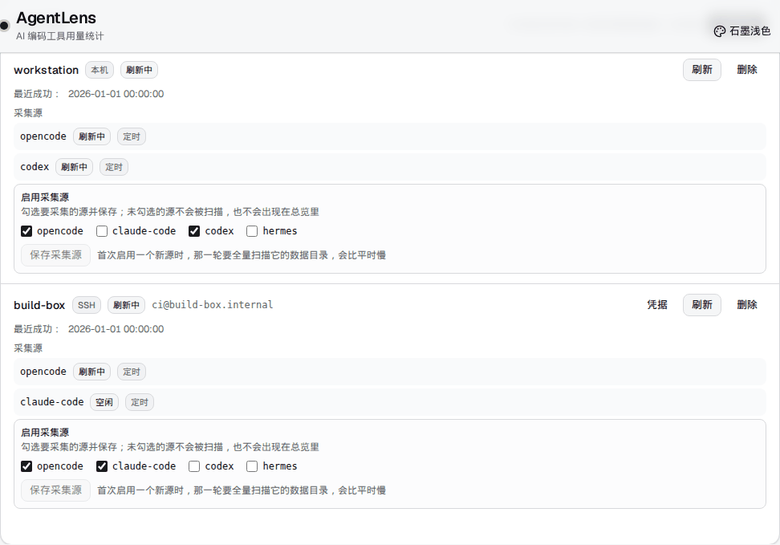

# AgentLens

[](https://github.com/sunerpy/AgentLens/actions/workflows/ci.yml)
[](https://codecov.io/gh/sunerpy/AgentLens)


**简体中文** · [English](docs/readme/README.en.md)

AgentLens 是一个桌面用量看板。它把本机和多台远端主机上 OpenCode、Claude Code、Codex、
Hermes 的用量记录采进同一个本地 SQLite 归档库，再按时区、Agent、模型和项目切开看趋势，
或者下钻到单条明细。默认只采 OpenCode，另外三个源要在主机卡片上逐个勾选。

## 目录

- [界面](#界面)
- [亮点](#亮点)
- [安装](#安装)
- [快速开始](#快速开始)
- [架构](#架构)
- [测试与质量](#测试与质量)
- [开发](#开发)
- [文档](#文档)
- [许可](#许可)

## 界面

总览页左边是三态侧栏，右边从上到下是区间与粒度、四类 Token 分桶、成本卡和用量趋势图。
这页值得说的是成本卡为什么只给一个数。它给的是「本地估算」，本机价目表乘可计费 Token
算出来的。别的数都不可比：带上游自带金额的记录用的是别人的价目表，目录里查不到价格的
记录连基数都不全，两类各自折叠在一个入口后面，都不并进估算值。卡上真正能横向比较的只有
每百万可计费 Token 的单价，它旁边那行「覆盖了多少条记录」是给这个估算标可信度的。趋势图
里的斜纹是没有数据覆盖的断裂桶，底色是部分覆盖。都不是 0。



同一张趋势图切到「按模型」分组，主题换成深海蓝。分组有不分组 / 模型 / agent / 工具四种，
主题六套，都在标题栏就地切换，不用绕去设置页。侧栏能展开、收成 64px 图标栏，也能整条藏掉。



用量分析页是来源 → agent → 模型 三级展开，区间和时区跟总览共用一份状态。这里唯一需要
解释的是缺价的行：它挂一个「成本缺失」标记，不填 0。填 0 会让人以为这段用量是免费的。
占比也只按本级 token 合计算，不跨级借基数。



主机页把本机和 SSH 远端并排放。采集源的开关做在每张主机卡上，不在设置页里，因为同一个源
在哪台主机上开、在哪台不开，本来就是两件事。默认只勾了 OpenCode。



## 亮点

- **归档库是权威历史，永不裁剪。** 源库轮转、备份被删、远端数据目录被整个清空，
  已归档的记录都还在。
- 远端采集全程只读。静态链接的 musl 采集器推到远端，校验 sha256，就地执行，退出时清掉
  自己。它不动远端工具的任何数据。
- 凭据只进操作系统钥匙串：Linux 走 Secret Service，Windows 走凭据管理器。口令不落配置
  文件，也不经 IPC 回传给界面。
- **日历分桶只有一份实现，在 Rust 侧。** 前端一个日期库都没装，没有 `date-fns`，
  没有 `dayjs`，也没有 `moment`。原始 epoch 全在后端按报表时区分桶，前端拿到的标签已经
  成型，不会被二次换算到另一个时区。
- TypeScript 契约由 `ts-rs` 从 Rust 类型生成，不是手写的，边界不会悄悄漂移。
- **定价允许跨 provider 回退。** 同一个模型经不同网关接入时，价格条目往往只挂在归属方
  名下，严格按 `(provider, model)` 匹配会大面积查不到价。实测 251737 条记录，可定价
  比例从 0.1% 提到 99.4%。手工覆盖价是例外，仍然精确匹配，不外溢。
  规则见 [docs/measurement.md](docs/measurement.md)。

## 安装

预编译包有三个：`.deb`（Linux x86_64）、NSIS 安装包（Windows x64）、`.dmg`（macOS
aarch64）。一行式脚本会自己认平台，**用发布清单校验 SHA-256**，不自行提权。

```sh
curl -fsSL https://raw.githubusercontent.com/sunerpy/AgentLens/main/scripts/install.sh | bash
```

```powershell
irm https://raw.githubusercontent.com/sunerpy/AgentLens/main/scripts/install.ps1 | iex
```

不想把脚本管道给 shell，就从 release 页面下载后手工校验：

```sh
sha256sum -c sha256sums-linux.txt
sudo apt install ./AgentLens_*_amd64.deb
```

完整步骤、环境变量、安装后的文件布局与从源码构建：
[docs/installation.md](docs/installation.md)。

## 快速开始

1. 安装后启动 **AgentLens**。
2. 打开「主机管理」。本机会在首次打开时自动注册，无需配置。
3. 添加 SSH 主机，点「测试连接」。机器标识哈希会由探测结果自动填入并转为只读，保存即可。
4. **在主机卡片上勾选要采集的源。** 启用入口在主机卡片上，不在设置页；默认只有 OpenCode，
   Claude Code、Codex 与 Hermes 需要逐个勾选。
5. 在主机卡上点刷新即可采集。本机与远端都可以改成自动刷新，远端用独立的间隔，
   两者的下限都是 600 秒。

逐步说明，包含机器标识去重规则与采集器的传输方式：
[docs/remote-hosts.md](docs/remote-hosts.md)。

归档库、价格覆盖表与密钥在各平台的存放位置：
[docs/data-storage.md](docs/data-storage.md)。

## 架构

| 组成 | 路径 | 职责 |
| --- | --- | --- |
| 核心 crate | `crates/agentlens-core` | 归档、解析、聚合、SSH 传输 |
| 远端采集器 | `crates/agentlens-collector` | 静态 musl 单文件，按需推送到远端 |
| 口令助手 | `crates/agentlens-askpass` | `SSH_ASKPASS` 对端，随包分发 |
| 桌面壳 | `src-tauri/` | Tauri 2 宿主、IPC 命令、托盘 |
| 前端 | `frontend/` | React 18.3.1 + Vite 8 + Tailwind v4 |

归档库是 SQLite，带去重和按源水位线。SSH 那一侧的远端命令是恒定的，变的只有当作位置参数
传进去的载荷，命令本身不参与拼接。详见 [docs/architecture.md](docs/architecture.md)。

## 测试与质量

| 层级 | 数量 | 命令 |
| --- | --- | --- |
| Rust workspace | 426 条 | `make test` |
| Vitest 单测 | 560 条 | `make test-unit` |
| Playwright 组件级 | 151 条，mock IPC | `make test-e2e` |
| WebdriverIO | 8 个 spec，真 Tauri WebView 对 155k 行归档库 | `make test-e2e-real` |
| 行覆盖率 | 实测 92.72%，下限 90% 由 `make coverage-gate` 强制 | `make coverage-gate` |

GitHub Actions 的三平台矩阵（ubuntu / windows / macos）在 `main` 上全绿，三平台也都在
AWS CodeBuild 上出过真实安装包。**绿灯只说明缺陷没有复现，不说明产品能用。** Windows
上另跑了一轮真机验收：EC2 Windows Server 上装包、启动，25 条机器可判定的 GUI 断言
全过。Linux 和 macOS 目前只到出包这一步，没做过同样的真机启动验收。

覆盖率地板的实现方式、每个平台的构建 ID、产物字节数，以及真机验收的逐条断言：
[docs/readme/development.zh.md](docs/readme/development.zh.md)。

## 开发

```sh
make help          # 列出全部目标
make dev           # Tauri 开发模式
make fmt           # 格式化 Rust + 前端
make lint          # cargo fmt/clippy + 前端 lint/typecheck + 文案门禁
make test          # cargo test --workspace
make test-unit     # vitest
make test-e2e      # Playwright 组件级 QA（mock IPC）
make test-e2e-real # WebdriverIO 对真 WebView
make coverage-gate # 覆盖率并强制下限
make dist          # 产出 artifacts/dist/
```

更多内容，包含 `dist` 系列目标与 AWS CodeBuild 路径：
[docs/development.md](docs/development.md)。

## 文档

- [安装](docs/readme/installation.zh.md)
- [仓库元数据](docs/readme/repo-metadata.zh.md)
- [添加远端主机](docs/readme/remote-hosts.zh.md)
- [数据存放与设置](docs/readme/data-storage.zh.md)
- [架构](docs/readme/architecture.zh.md)
- [开发与构建](docs/readme/development.zh.md)
- [给 AI 编码助手](docs/readme/ai-assistants.zh.md)
- [Remote Source API v1](docs/remote-source-api.md)
- [四个源的计量口径（横向对照）](docs/measurement.md)
- 适配器契约：[Codex](docs/adapters/codex.md)、
  [Claude Code](docs/adapters/claude-code.md) 与 [Hermes](docs/adapters/hermes.md)

英文版文档在 [docs/](docs/) 下同名文件。`docs/measurement.md` 与 `docs/adapters/`
只有中文版，因为它们是逐字段的口径契约，翻译副本一旦漂移比没有更糟。

## 许可

[MIT](LICENSE) © 2026 sunerpy
